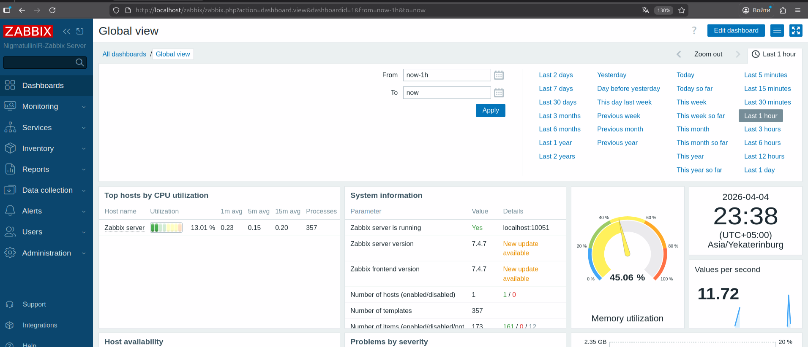

# Домашнее задание к занятию "Система мониторинга Zabbix" - Нигматуллин Ильяс

## Задание 1

Установлен Zabbix Server с веб-интерфейсом на Ubuntu 24.04 с использованием PostgreSQL и Apache.  
После установки выполнена первичная настройка базы данных, импорт схемы и запуск сервисов.  
Веб-интерфейс Zabbix успешно открылся, выполнен вход в административную панель.

### Этапы выполнения

1. Обновил систему и установил необходимые утилиты.
2. Установил PostgreSQL.
3. Подключил официальный репозиторий Zabbix 7.4.
4. Установил пакеты Zabbix Server, Zabbix Frontend, Apache и Zabbix Agent.
5. Создал пользователя и базу данных PostgreSQL для Zabbix.
6. Импортировал начальную схему Zabbix в базу данных.
7. Настроил файл `/etc/zabbix/zabbix_server.conf`.
8. Настроил locale для корректной работы веб-интерфейса.
9. Запустил и добавил в автозапуск службы Zabbix Server, Zabbix Agent и Apache.
10. Открыл веб-интерфейс и выполнил вход в административную панель.

### Использованные команды

```bash
sudo apt update
sudo apt upgrade -y
sudo apt install -y ca-certificates wget gnupg lsb-release
sudo apt install -y postgresql

wget https://repo.zabbix.com/zabbix/7.4/release/ubuntu/pool/main/z/zabbix-release/zabbix-release_latest_7.4+ubuntu24.04_all.deb
sudo dpkg -i zabbix-release_latest_7.4+ubuntu24.04_all.deb
sudo apt update

sudo apt install -y zabbix-server-pgsql zabbix-frontend-php php8.3-pgsql zabbix-apache-conf zabbix-sql-scripts zabbix-agent

sudo -u postgres createuser --pwprompt zabbix
sudo -u postgres createdb -O zabbix zabbix

zcat /usr/share/zabbix/sql-scripts/postgresql/server.sql.gz | sudo -u zabbix psql zabbix

sudo nano /etc/zabbix/zabbix_server.conf

sudo apt install -y locales
sudo locale-gen en_US.UTF-8
sudo update-locale LANG=en_US.UTF-8 LC_ALL=en_US.UTF-8
sudo nano /etc/apache2/envvars

sudo systemctl restart zabbix-server zabbix-agent apache2
sudo systemctl enable zabbix-server zabbix-agent apache2

